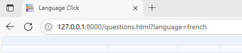

## Features Testing

How the features outlined in the scope work. Each feature developed was generated with html, tested in [ Chrome DevTools](https://developer.chrome.com/docs/devtools/), styled with css, tested again in dev tools and adjusted until visual and functional criteria was met across mobile, tablet and laptop. Functionality was added to features using JavaScript and tested in dev tools for functionality. These features were then tested again on push in the deployed environment.

### Responsive Design

Website appearance and function was tested on the following devices using a mixture of dev tools and actual devices. On each device, all screens were brought up and all buttons were pressed to confirm functionality and readbility throughout the game.

Phones

- iPhone SE**
- iPhone XR*
- iPhone 12 Pro*
- iPhone 14 Pro Max*
- Pixel 7*
- Samsung Galaxy S8+*
- Samsung Galaxy S20 ultra*
- Galaxy Z Fold 5*
- Samsung A51/71*

Tablets

- iPad Mini*
- iPad Pro*
- iPad*

Laptops and Desktops

- Nest Hub*
- Nest Hub Max*
- HP Laptop*

### Instructions Pop-up

located in the header across all screens for intuitive design.
- Icon displays in the same location across all pages.
- Hovering over the icon shows the text "Instructions"
- Clicking on the icon displays the instructions on the screen.
- The instructions are readable.
- Clicking on the cross in the instructions pop-up closes the instructions down.
- The cross is in the same location each time the instructions pop-up opens.

### Generation of Random Questions

Ensures that questions are displayed to the player in a random order.
- Tested using console log and refreshing the page to ensure a different question is logged each time in a random order.

### Generation of Answers in a Random Order

Ensures the answer isn't in the same button every time.
- Tested using preview and deployed site by refreshing the page to ensure the correct answer was in a different button each time. 
- Confirmed the answer was in a different button from when the first time a question appeared to when the same question looped around.

### Check Answer Function

Gives the user feedback as to whether their answer was correct or incorrect.
- Tested using preview and deployed site by playing the game and selecting all the buttons.
- Checked incorrect answers returned red.
- Checked correct answers returned green and revealed the next button.

### Next Button

Allows the user to move to the next question once the correct answer is selected.
- tested using preview and deployed site by playing the game and selecting all the buttons.
- Checked next did not appear if an incorrect answer was selected.
- Checked next did appear if a correct answer was selected.

### URL Query Parameters

Allows for the selection of the corresponding question set to the language that has been chosen by the player.

- Tested each option appears in the URL on the preview and the deployed site.

### Language Selection Buttons

Allows the user to select a language to learn.
- tested using preview and deployed site by playing the game in each language.
- Selected return between each game and confirmed the language changed when moving from one to another.
- Confirmed the correct language displayed for the button pressed.

### Correct Answer Counter

Counts the amount of questions answered correctly.
- tested using preview and deployed site.
- selected correct answer and counter increased.
- selected incorrect answer and counter remained unchanged.

## Bugs and Fixes

The main bugs experienced during the development of the website were:

The popup was visible without executing the instructions button:

https://github.com/user-attachments/assets/b6653412-e9d8-4bee-9ea8-626cad167a3e

This was caused by an additonal div close tag, there was 3 close tags and only 2 open tags within the html popup code section. I established this was the issue by confirming the fault was with the paragraph section only as seen in the clip, checking the devtools for javascript errors, confirming there was no syntax differences in the id reference and then commenting out code within the html to isolate the error.

When closing the instructions pop up on the language selection page the return button is executed:

https://github.com/user-attachments/assets/c322f468-4a85-4171-b37f-fa695355cf4b

This was caused by the popup div being inserted inside the return button link anchor tags. I determined this was the case by moving the position of the popup close button, increasing the z-index and moving the entire pop up box. Isolating the link between the close button and the return button to html .

The answers generated for the buttons duplicate:

This could cause issues if the correct answer doesn't get displayed, the code needed to be adjusted to ensure that each answer was used once. In order to do this without affecting the original answers array a slice method was added to the part of the function that defines the answers. This allowed the question to be displayed more than once throughout the game. The answers were then spliced to remove each option that was used in the loop. The splice method ensures that each answer that is used is removed and therefore not used again in the same question. 

The next question button would not generate a new question when clicked:

https://github.com/user-attachments/assets/10f6a184-0892-446d-acfa-bf6d2f727565

This was caused by missing an onclick attribute to the next button element and by having the question function outside of the choose question function which prevented a new question from being displayed as the question function controlled the content within the buttons. 

The button colours did not revert on the next question:

This was reset by adding a for loop to change the colour back to the original button colour defined in the css file as soon as the answer boxes have been fetched. Another potential solution tried was using a toggle instead of a style change in the check function but this complicated the code and made it longer in the css sheet.

## Credits

All content and code was written by the developer.

[VSCode](https://code.visualstudio.com/)

- used to develop custom html and css for the website.

[Favicon](https://favicon.io/)

- Favicon

[Freepik](https://www.freepik.com/)

- Icon images.

[CSS Gradient](https://cssgradient.io/swatches/)

- Gradient application to Language Click title

[Balsamiq](https://balsamiq.com/)

Used to draw up wireframesa and summary image used in readme file.

[W3C CSS validator](https://jigsaw.w3.org/css-validator/)

- css validation testing

[W3C HTML validator](https://validator.w3.org/#validate_by_input)

- html validation testing

[ Chrome DevTools](https://developer.chrome.com/docs/devtools/)

- manual and responsiveness testing,

---
