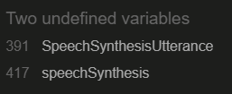

# User Experience - Surface

## Design Elements

Being able to speak the language of a country you are visiting or the native language of those closest to you brings a new colouring to these experiences. The colours used in the game are full and virbant to reflect this. 

## Colour Scheme

The main background and titles throughout the game are a gradient across the colours in the image below.  These were chosen for their brightness to invoke a positive and fun learning experience.

The buttons for interactivity are made up of #67AEFF and for the hover  #A5E5FF, these colours contrast with the background and main elements well but stand out for user experience and readability.

The text within the buttons is white and bold for readability. 

For the instructions pop up the text is #FE3A9E from the main colour scheme on a white background. This maintained the consistency and readbility but signified the separation from the main theme so that the pop up didn't blend in.

## Contrast

When pop-ups are displayed this takes the player outside of the interactive screens to view the instructions or signify the end of the game.
To improve readbility and show the player they are outside of the interactive game and will need to close the pop up or return to the start if they are at the end of the game a contrasting overlay in a black tint is layered over the interactive screens.

   

       

## Font

Segoe UI with a back up of sans-serif was used throughout the game. This font was selected due to its readbility for the player to easily determine the options for the game answers.

## Application Programming Interface - API

To extend the functionality of the game and the player's learning experience an API was integrated into the code to enable the question to be read aloud. This additonal functionality enhanced learning by providing the player with pronounciation knowledge as well as learning the definition of the word or phrase. 

The API used was [Web Speech API](https://developer.mozilla.org/en-US/docs/Web/API/Web_Speech_API) which is a browser API. The Web Speech API has two components, the ability to recognise speech and the ability to generate speech, the speech generation component was the main focus of the use of the API in Language Click.

Web Speech API speech synthesis principle of operation:
- Define an utterance (the text to be spoken).
- Adjust utterance properties to specify language and voice styles e.g. pitch, volume, or rate.
- Call the speak method to specify when the browser should process the utterance and its properties. 

Third party APIs such as [International Business Machines(IBM)](https://www.ibm.com/products/text-to-speech) Cloud Watson Text to Speech and [Amazon Web Services (AWS) Polly](https://aws.amazon.com/polly/) were also considered for use in the Language Click project. These APIs both provided in excess of the needs of the project, as more complex provisions of functionality, they would over complicate integration and cause unncessary additonal code within the Java Script file for the overall requirements of the project. In additon to this both of these third party APIs came at a cost beyond 10 minutes of use per month which would put a limit on the amount of testing that could be done and also scalability of the project. The use of the browser API Web Speech API was sufficient for the project specification and allowed for the project to be scaled up to include levels, more questions, and increased testing without costs. 

Another browser API was integrated, [Web Storage API](https://developer.mozilla.org/en-US/docs/Web/API/Web_Storage_API), which was used to store selected values across the pages to determine both a language and a level for the player to determine the difficulty of the questions. In order to do this the local storage mechanism within the Web Storage API was utilised to save the value of the language and level button selected

Web Storage API local storage principle of operation:
- Define a variable and store the value in the browser's local storage using setItem.
- Recall the value to be used on another page using getItem.

## Principles of Automated and Manual Testing

### Manual Testing
Carried out by interacting with the development to ensure functionality, readability, and uncover any issues.

#### When Manual Testing is Beneficial
- Identifying bugs during development. 
- Identifying issues with surface elements such as, device responsiveness, readability and contrast.
- Identifying shortfalls in the strategy: ensuring the development meets the user stories.

### Automated Testing
Test scripts are developed and executed using programs such as Jest or Playwright, automatically returning the results.

#### When Automated Testing is Beneficial
- Repetitive testing to identify intermittent issues.
- Regression testing, testing for issues to existing code when updates are introduced to the development, e.g. code refinement, architectural code base version update, and new functions introduced.
- Assessing the stablity and security of the development.

#### Comparing Automated and Manual Testing
|Consideration   | Manual         | Automated      |
|----------------|----------------|----------------|
| Cost           | Increased human resource requirement for large amounts of testing. Cost effective for user experience testing, complex tests, and testing during development| Requires higher skill level human resource with development proficiency. Cost effective for repetitive testing, preparing minimum viable products, security/ stablity testing to the level of industry standards.
| Time           | Time per test longer, test reporting time consuming, less efficient for repititive testing and large scale testing | Setting up test script time consuming but scalable with automatic report generation and execution time faster.
| Accuracy       | Accuracy excels in human interactivity, e.g. user experience and surface design, but lacks in fault replication and intermittent issues requiring repeat testing. | High levels of accuracy in large scale repetitive testing but unable to detect errors in design or user experience accessibility.
| Coverage       | Covers user stories, user experience, accessibility, development surface and exploratory testing during development. | Covers performance testing, load testing, reptitive routine tests for functionality, and security. 
| Output         | Captures actual user experience, reactive responses to bugs, design, cross device responsiveness and accessibility. | Test report with pass/ fail table and error descriptions where applicable. Overview of development performance. 

#### Application To This Project

Manual Testing:

Language click is a game designed for learning languages and so it is constructed with large amounts of user experience and accessibility to consider. Manual testing is key and irreplacable for ensuring the game works, is fun, is readable, and interacts the way a human would expect it to.

Automated Testing:

While the majority of testing applied to Language Click is manual and that is the most appropriate testing type for the focus of the game automated testing is not obsolete for this project. Automated testing plays it's part in the perfomance of the instructions button and return button which feature consistently throughout the game and are time consuming to test. Particularly the return button as this takes you back to the start of the game. 

## Features Testing

How the features outlined in the scope work. Each feature developed was generated with html, tested in [ Chrome DevTools](https://developer.chrome.com/docs/devtools/), styled with css, tested again in dev tools and adjusted until visual and functional criteria was met across mobile, tablet and laptop. Functionality was added to features using JavaScript and tested in dev tools for functionality. These features were then tested again on push in the deployed environment.

### Responsive Design

Website appearance and function was tested on the following devices using a mixture of dev tools and actual devices. On each device, all screens were brought up and all buttons were pressed to confirm functionality and readbility throughout the game.

Phones

- iPhone SE**
- iPhone XR*
- iPhone 12 Pro*
- iPhone 14 Pro Max*
- Pixel 7*
- Samsung Galaxy S8+*
- Samsung Galaxy S20 ultra*
- Galaxy Z Fold 5*
- Samsung A51/71*

Tablets

- iPad Mini*
- iPad Pro*
- iPad*

Laptops and Desktops

- Nest Hub*
- Nest Hub Max*
- HP Laptop*

### Instructions Pop-up

located in the header across all screens for intuitive design.
- Icon displays in the same location across all pages.
- Hovering over the icon shows the text "Instructions"
- Clicking on the icon displays the instructions on the screen.
- The instructions are readable.
- Clicking on the cross in the instructions pop-up closes the instructions down.
- The cross is in the same location each time the instructions pop-up opens.

### Generation of Random Questions

Ensures that questions are displayed to the player in a random order.
- Tested using console log and refreshing the page to ensure a different question is logged each time in a random order.

### Questions Displayed Without Duplication

Ensures that questions aren't duplicated so that the player isn't repeatedly asked the same question.
- Tested using console log and playing the game to make sure all the questions are cycled through without repeats.
- Ensured the questions weren't repeated even if the wrong answers were selected at first.

### Generation of Answers in a Random Order

Ensures the answer isn't in the same button every time.
- Tested using preview and deployed site by refreshing the page to ensure the correct answer was in a different button each time. 
- Confirmed the answer was in a different button from when the first time a question appeared to when the same question looped around.

### Check Answer Function

Gives the user feedback as to whether their answer was correct or incorrect.
- Tested using preview and deployed site by playing the game and selecting all the buttons.
- Checked incorrect answers returned red.
- Checked correct answers returned green and revealed the next button.

### Next Button

Allows the user to move to the next question once the correct answer is selected.
- tested using preview and deployed site by playing the game and selecting all the buttons.
- Checked next did not appear if an incorrect answer was selected.
- Checked next did appear if a correct answer was selected.

### Language Selection Buttons

Allows the player to select a language to learn.
- tested using preview and deployed site by playing the game in each language.
- Selected return between each game and confirmed the language changed when moving from one to another.
- Confirmed the correct language displayed for the button pressed.

### Level Selection Buttons

Allows the player to select a difficulty level.
- tested using preview and deployed site by playing the game in each language and level.
- Selected return between each game and confirmed the level changed when moving from one to another.
- Confirmed the correct set of questions played for each level.

### Answer Selection Buttons

Allows the player to select an answer to the question.
- tested using preview and deployed site by playing the game and having others play the game.
- once an answer is selected all answer buttons disable preventing multiple answers.
- the player receives immediate feedback as to whether the answer is correct or incorrect.
- the order the answer options are displayed changes each time next or retry is pressed moving the correct answer position at random.

### Correct Answer Counter

Counts the amount of questions answered correctly.
- tested using preview and deployed site.
- selected correct answer and counter increased.
- selected incorrect answer and counter remained unchanged.

### Questions Attempted Counter

counts the amount of questions attempted.
- tested using preview and deployed site.
- selected correct answer and counter increased.
- selected incorrect answer and counter increased.

### End of Game Pop Up

Displays when the player has answered all the questions correctly.
- tested using preview and deployed site with dev tools console at first logging "end".
- Commented out questions and added questions to play the game at various lengths to ensure the pop up displayed no matter the length of questions for scalability.
- Once all questions completed the pop up displayed.
- return button in pop up takes the player back to the start screen

### End of Game Percentage in Pop-Up

Percentage of correct answers displayed to show player overall score.
- tested using the preview and deploayed site logged in dev tools first and then translated to replace inner text.
- played game numerous times varying amount of correct answers to ensure percentage calculated adapats to scores.

### API Testing

### Text to Speech API

Converts question into speech when clicked on by the player.
- tested using the preview and deployed site by clicking the question button to play the audio version of the question.
- tested across all the languages and questions within them.
- tested the language of the voice changed to match the language of the question set selected by the player.

#### Error Handling for Speech Synthesis

Speech synthesis may not be compatible with all browsers, in order to inform the player if this is the case an error handler was set up if the speech synthesis was tried and failed.

If a language is not available or compatible the error message won't display as the API defaults to english, speech is still synthesised so the try is successful. To inform the player the language is unavailable a default was set up to display the message informing them it has defaulted to English.

These were implemented as console messages while testing the function and then displayed as on screen.
Testing was carried out by causing syntax errors in the code.

### Local Storage API

Stores the values selected by the player to determine the language and difficulty of the question set they play.
- tested using preview and deployed site by selecting different language and level options and checking the local storage using DevTools and ensuring the resulting outcome in question types match the defined question sets.

#### Error Handling for Local Storage

While local storage has a wide range of compatibility, anyone operating on very old browsers won't have access to it. If this is the case then the question's won't display. In order to relay this to the player an error message displays.

Testing was carried out by causing syntax errors in the code.

## Automated Testing 

I used [Playwright](https://playwright.dev/) to set up and carry out automated tests across the game. 
#### Writing The Automated Tests
To begin with I set up a simple test for the homepage overview to gain an understanding of how Playwright interacted with the development. This was removed as it replicated a simple manual test of checking the home page content.

I used automated testing to check the function of the instructions pop up and the return arrow across all the pages. The best way to write the test script for this purpose was on one page in an end to end test rather than individual tests. This is because the structure of the game is sequential therefore to move through the pages to check the instructions pop up works the test script had to move through the pages in the same sequential way the player would which includes using the return arrow to access the language and level menu. 

I started by writing the test for the home page and then refined the code to make it repeatable for further pages.

### Tests:

#### Instructions Pop Up
For user experience this pop up is available on every page and contains the same content. The test runs to check the pop up icon can be clicked and when it is clicked displays the instructions. It also checks the close pop up can be clicked and it is then hidden.

Refined section of test script for checking the function of the instructions button

## Bugs and Fixes

The main bugs experienced during the development of the website were:

### The popup was visible without executing the instructions button:

https://github.com/user-attachments/assets/b6653412-e9d8-4bee-9ea8-626cad167a3e

This was caused by an additonal div close tag, there was 3 close tags and only 2 open tags within the html popup code section. I established this was the issue by confirming the fault was with the paragraph section only as seen in the clip, checking the devtools for javascript errors, confirming there was no syntax differences in the id reference and then commenting out code within the html to isolate the error.

### When closing the instructions pop up on the language selection page the return button is executed:

https://github.com/user-attachments/assets/c322f468-4a85-4171-b37f-fa695355cf4b

This was caused by the popup div being inserted inside the return button link anchor tags. I determined this was the case by moving the position of the popup close button, increasing the z-index and moving the entire pop up box. Isolating the link between the close button and the return button to html .

### The answers generated for the buttons duplicate:

This could cause issues if the correct answer doesn't get displayed, the code needed to be adjusted to ensure that each answer was used once. In order to do this without affecting the original answers array a slice method was added to the part of the function that defines the answers. This allowed the question to be displayed more than once throughout the game. The answers were then spliced to remove each option that was used in the loop. The splice method ensures that each answer that is used is removed and therefore not used again in the same question. 

### The next question button would not generate a new question when clicked:

https://github.com/user-attachments/assets/10f6a184-0892-446d-acfa-bf6d2f727565

This was caused by missing an onclick attribute to the next button element and by having the question function outside of the choose question function which prevented a new question from being displayed as the question function controlled the content within the buttons. 

### The button colours did not revert on the next question:

This was reset by adding a for loop to change the colour back to the original button colour defined in the css file as soon as the answer boxes have been fetched. Another potential solution tried was using a toggle instead of a style change in the check function but this complicated the code and made it longer in the css sheet.

### The player could continue to select answers after the first guess

If the player selected the correct answer they could continue to press answers revealing both the next and retry buttons.
If the player selected the incorrect answer they could click through all the answers until they found the correct one.
Each press increased the question counter even if the correct one was selected first.
This was corrected by adding a disabled property to each answer button as part of the check answer function disabling all the answer buttons after the first guess was selected. The disabled property was removed in the question function that sets up the next question so they work again when retry or next is selected. 

### On mobile devices the player's view cut out the next and retry buttons as they popped up so they would have to scroll down to see it.

https://github.com/user-attachments/assets/b8818271-1d2f-4099-ab32-4a78c16baf69

This could cause bad user experience as it is not clear what to do once a question has been answered.
This was resolved by adjusting the font, bubble, and button size for smaller screens so that readability was maintained while bringing the full game onto the screen. 
An alternative solution considered was a pop up with the next or retry button on but this could disrupt the user experience by making the game slower with added code, and from a design perspective made the game screen too busy.

### The questions repeat, the player may get the same question numerous times in a row.

This was fixed in a similiar way to the answer button duplication by removing the question from the array once answered correctly. The image shows the testing carried out to ensure the splice was removing the correct question. The first console log was the question being played and the second console log was the question the splice removed.

This caused the game to stop abruptly once every question had been answered without notifying the user.The next and retry buttons don't show anymore, and there was an error in the console as all the questions had been removed from the question set by the above splice method.

To resolve the error and ensure good user experience an end of game screen was added. 

Adding an if statement to the function that fills the question and answer buttons removes this error, the if statement is looking for the question list length to equal 0 so it can display the end of game pop up. This is because each question is removed from the list once played and when the length of the list = 0 it causes an error as this function cannot get the values to fill the buttons the new if statement gives the function something to do when the list equals 0 and so cancels the error.

### Compatibility error with webkit background-clip property

The -webkit-background-clip property is not compatible across all browsers which caused a problem to appear in the terminal. To fix this a backup is required for non-compatible browsers with the standard background-clip property. 

### Undefined Local Storage

Initially the local storage showed the language value as undefined. The local storage setItem was working as it stored a value whenever a language was selected. The undefined value was caused by the event listener being attached to all the buttons via the div container. The issue was resolved by implementing a for each loop to the buttons so that they each had an individual event listener to deploy the setItem function.

### Language Defaulting to Spanish

https://github.com/user-attachments/assets/0f782b2f-af65-4b2d-bcaf-e71a554ec71a

Every language returned a spanish question set, the levels came back correctly but the question set was defaulting to Spanish. This was caused by a syntax error on the switch case, with the switch checking language, level it was only checking level as it was not defined for both to be checked together. Resolved by changing to switch language + level.

### Null element error

This error displayed in the dev tools console on every page except the questions page as the choose question function was trying to run before the related elements had loaded. Resolved by implementing an if function to check the pathname included questions.html before running the function.

## Validators

### Markup Validation Service

I used this [HTML validator](https://validator.w3.org/#validate_by_input)
The errors found were as follows:

I had placed the ID instructions on both the button and the icon image for the instructions button and the return button. Removing the ID from the icon caused the icon position to become displaced but this was resolved by targeting the size of the button itself. This impacted all HTML pages.

Missing opening p tag on the instructions pop up, impacted all HTML pages, added to resolve the issue.

All buttons with links were attached using anchor elements, updated to best practice using javascript onclick document location redirect.
Text within the buttons were inside H2 tags for styling, these were removed for better practice and the style adjusted on the button element in css. 
These impacted all HTML pages with buttons.

Missing hyphen between aria and label caused syntax error on two of the answer buttons, implemented these to correct the error.

Each page was tested using the same validator, most errors occured numerous times across all pages, the code was fixed for each page and ran through the validator until no errors were reported. After each fix the code was manually tested again to ensure game function.

### CSS Validation Service

I used this [CSS validator](https://jigsaw.w3.org/css-validator/validator). No errors were found.

### Java Script Linter

I used this [JS linter](https://jshint.com/).
The errors found were as follows:

This refers to the functions defined within the classes set up at the start of the JS file, these should have been declared as methods so removing the arrow function resolved the issue.

This refers to a try block encompassing the choose question set function. Moving the try to encompass when the function is called solved the error but the error handling did not work after this.
The reason the error handling stopped working was because it only catches errors with the local storage not with the language or level selection itself so implementing a default to throw an error resolved this.
The end pop up did not remain hidden with the code used after these fixes so the logic in the if statement that triggers the end of game message to pop up was adjusted to check for errors resolving this issue. 

The remaining warnings from JSHint were missing semicolons or unnecessary semicolons which were instated or removed to resolve the issue.

The linter recognised the speech synthesis shorthand as undefined, to prevent potential compatibility errors, placing window. before the speech synthesis resolves this.

The linter identified the functions as unused but this was ignored as these functions are called using the onclick attribute and are identified as such in the notes within the JS file.

After each fix the code was manually tested again to ensure game function.

## Deployment

This project was developed in VS Code, committed and pushed using the source control feature in VS Code connected to GitHub.

The website was deployed using GitHub Pages via the below steps:

1. Select repository.
2. Access settings.
3. Access the pages tab.
   - Ensure source is set to deploy from branch.
   - Select main branch and root.
4. Select Save.

Once save is selected a link will be generated for the website which will be available under deployments

## Deployed Project

### Mobile

https://github.com/user-attachments/assets/516c6595-d90a-42d1-91ef-8c8fcf7d91a2

### Tablet

https://github.com/user-attachments/assets/4cc91dc9-de2e-4059-850a-d7c752669074

### Laptop

https://github.com/user-attachments/assets/5c2561b8-de1e-4b51-a497-23b78d9fdb7e

## Credits

All content and code was written by the developer.

[VSCode](https://code.visualstudio.com/)

- used to develop custom html and css for the website.

[Favicon](https://favicon.io/)

- Favicon

[Freepik](https://www.freepik.com/)

- Icon images.

[Speech Bubble Generator](https://www.html-code-generator.com/css/speech-bubble-generator)

- Basis for speech bubble containers 

[Colour Swatches and Gradient](https://mycolor.space/?hex=%23D53369&sub=1)

- Colour palettes and background gradients.

[Balsamiq](https://balsamiq.com/)

Used to draw up wireframesa and summary image used in readme file.

[W3C CSS validator](https://jigsaw.w3.org/css-validator/)

- css validation testing

[W3C HTML validator](https://validator.w3.org/#validate_by_input)

- html validation testing

[ Chrome DevTools](https://developer.chrome.com/docs/devtools/)

- manual and responsiveness testing,

[JSHint](https://jshint.com/).

- Java Script Linter for JS validation testing.

---

### Acknowledgements

Developed with the support of

- Marcel, my tutor.
- James, my partner.
- Raghav, my lecturer.
- The Code Institute, learning content provider.
- Slack community and fellow students.
