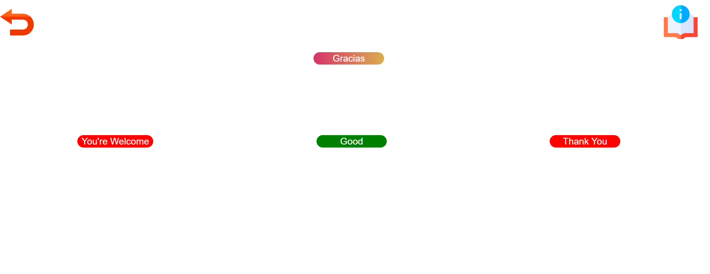

# User Experience - Surface

## Design Elements

Being able to speak the language of a country you are visiting or the native language of those closest to you brings a new colouring to these experiences. The colours used in the game are full and virbant to reflect this. 

## Colour Scheme

The main background and titles throughout the game are a gradient across the colours in the image below.  These were chosen for their brightness to invoke a positive and fun learning experience.

The buttons for interactivity are made up of #67AEFF and for the hover  #A5E5FF, these colours contrast with the background and main elements well but stand out for user experience and readability.

The text within the buttons is white and bold for readability. 

For the instructions pop up the text is #FE3A9E from the main colour scheme on a white background. This maintained the consistency and readbility but signified the separation from the main theme so that the pop up didn't blend in.

## Font

Segoe UI with a back up of sans-serif was used throughout the game. This font was selected due to its readbility for the player to easily determine the options for the game answers.

## Features Testing

How the features outlined in the scope work. Each feature developed was generated with html, tested in [ Chrome DevTools](https://developer.chrome.com/docs/devtools/), styled with css, tested again in dev tools and adjusted until visual and functional criteria was met across mobile, tablet and laptop. Functionality was added to features using JavaScript and tested in dev tools for functionality. These features were then tested again on push in the deployed environment.

### Responsive Design

Website appearance and function was tested on the following devices using a mixture of dev tools and actual devices. On each device, all screens were brought up and all buttons were pressed to confirm functionality and readbility throughout the game.

Phones

- iPhone SE**
- iPhone XR*
- iPhone 12 Pro*
- iPhone 14 Pro Max*
- Pixel 7*
- Samsung Galaxy S8+*
- Samsung Galaxy S20 ultra*
- Galaxy Z Fold 5*
- Samsung A51/71*

Tablets

- iPad Mini*
- iPad Pro*
- iPad*

Laptops and Desktops

- Nest Hub*
- Nest Hub Max*
- HP Laptop*

### Instructions Pop-up

located in the header across all screens for intuitive design.
- Icon displays in the same location across all pages.
- Hovering over the icon shows the text "Instructions"
- Clicking on the icon displays the instructions on the screen.
- The instructions are readable.
- Clicking on the cross in the instructions pop-up closes the instructions down.
- The cross is in the same location each time the instructions pop-up opens.

### Generation of Random Questions

Ensures that questions are displayed to the player in a random order.
- Tested using console log and refreshing the page to ensure a different question is logged each time in a random order.

### Questions Displayed Without Duplication

Ensures that questions aren't duplicated so that the player isn't repeatedly asked the same question.
- Tested using console log and playing the game to make sure all the questions are cycled through without repeats.
- Ensured the questions weren't repeated even if the wrong answers were selected at first.

### Generation of Answers in a Random Order

Ensures the answer isn't in the same button every time.
- Tested using preview and deployed site by refreshing the page to ensure the correct answer was in a different button each time. 
- Confirmed the answer was in a different button from when the first time a question appeared to when the same question looped around.

### Check Answer Function

Gives the user feedback as to whether their answer was correct or incorrect.
- Tested using preview and deployed site by playing the game and selecting all the buttons.
- Checked incorrect answers returned red.
- Checked correct answers returned green and revealed the next button.

### Next Button

Allows the user to move to the next question once the correct answer is selected.
- tested using preview and deployed site by playing the game and selecting all the buttons.
- Checked next did not appear if an incorrect answer was selected.
- Checked next did appear if a correct answer was selected.

### URL Query Parameters

Allows for the selection of the corresponding question set to the language that has been chosen by the player.

- Tested each option appears in the URL on the preview and the deployed site.

### Language Selection Buttons

Allows the player to select a language to learn.
- tested using preview and deployed site by playing the game in each language.
- Selected return between each game and confirmed the language changed when moving from one to another.
- Confirmed the correct language displayed for the button pressed.

### Answer Selection Buttons

Allows the player to select an answer to the question.
- tested using preview and deployed site by playing the game and having others play the game.
- once an answer is selected all answer buttons disable preventing multiple answers.
- the player receives immediate feedback as to whether the answer is correct or incorrect.
- the order the answer options are displayed changes each time next or retry is pressed moving the correct answer position at random.

### Correct Answer Counter

Counts the amount of questions answered correctly.
- tested using preview and deployed site.
- selected correct answer and counter increased.
- selected incorrect answer and counter remained unchanged.

### Questions Attempted Counter

counts the amount of questions attempted.
- tested using preview and deployed site.
- selected correct answer and counter increased.
- selected incorrect answer and counter increased.

### End of Game Pop Up

Displays when the player has answered all the questions correctly.
- tested using preview and deployed site with dev tools console at first logging "end".
- Commented out questions and added questions to play the game at various lengths to ensure the pop up displayed no matter the length of questions for scalability.
- Once all questions completed the pop up displayed.
- return button in pop up takes the player back to the start screen

## Bugs and Fixes

The main bugs experienced during the development of the website were:

- The popup was visible without executing the instructions button:

https://github.com/user-attachments/assets/b6653412-e9d8-4bee-9ea8-626cad167a3e

This was caused by an additonal div close tag, there was 3 close tags and only 2 open tags within the html popup code section. I established this was the issue by confirming the fault was with the paragraph section only as seen in the clip, checking the devtools for javascript errors, confirming there was no syntax differences in the id reference and then commenting out code within the html to isolate the error.

- When closing the instructions pop up on the language selection page the return button is executed:

https://github.com/user-attachments/assets/c322f468-4a85-4171-b37f-fa695355cf4b

This was caused by the popup div being inserted inside the return button link anchor tags. I determined this was the case by moving the position of the popup close button, increasing the z-index and moving the entire pop up box. Isolating the link between the close button and the return button to html .

- The answers generated for the buttons duplicate:

This could cause issues if the correct answer doesn't get displayed, the code needed to be adjusted to ensure that each answer was used once. In order to do this without affecting the original answers array a slice method was added to the part of the function that defines the answers. This allowed the question to be displayed more than once throughout the game. The answers were then spliced to remove each option that was used in the loop. The splice method ensures that each answer that is used is removed and therefore not used again in the same question. 

- The next question button would not generate a new question when clicked:

https://github.com/user-attachments/assets/10f6a184-0892-446d-acfa-bf6d2f727565

This was caused by missing an onclick attribute to the next button element and by having the question function outside of the choose question function which prevented a new question from being displayed as the question function controlled the content within the buttons. 

- The button colours did not revert on the next question:

This was reset by adding a for loop to change the colour back to the original button colour defined in the css file as soon as the answer boxes have been fetched. Another potential solution tried was using a toggle instead of a style change in the check function but this complicated the code and made it longer in the css sheet.

- The player could continue to select answers after the first guess

If the player selected the correct answer they could continue to press answers revealing both the next and retry buttons.
If the player selected the incorrect answer they could click through all the answers until they found the correct one.
Each press increased the question counter even if the correct one was selected first.
This was corrected by adding a disabled property to each answer button as part of the check answer function disabling all the answer buttons after the first guess was selected. The disabled property was removed in the question function that sets up the next question so they work again when retry or next is selected. 

- On mobile devices the player's view cut out the next and retry buttons as they popped up so they would have to scroll down to see it.

https://github.com/user-attachments/assets/b8818271-1d2f-4099-ab32-4a78c16baf69

This could cause bad user experience as it is not clear what to do once a question has been answered.
This was resolved by adjusting the font, bubble, and button size for smaller screens so that readability was maintained while bringing the full game onto the screen. 
An alternative solution considered was a pop up with the next or retry button on but this could disrupt the user experience by making the game slower with added code, and from a design perspective made the game screen too busy.

- The questions repeat, the player may get the same question numerous times in a row.

This was fixed in a similiar way to the answer button duplication by removing the question from the array once answered correctly. The image shows the testing carried out to ensure the splice was removing the correct question. The first console log was the question being played and the second console log was the question the splice removed.

This caused the game to stop abruptly once every question had been answered without notifying the user.The next and retry buttons don't show anymore, and there was an error in the console as all the questions had been removed from the question set by the above splice method.

To resolve the error and ensure good user experience an end of game screen was added. 

Adding an if statement to the function that fills the question and answer buttons removes this error, the if statement is looking for the question list length to equal 0 so it can display the end of game pop up. This is because each question is removed from the list once played and when the length of the list = 0 it causes an error as this function cannot get the values to fill the buttons the new if statement gives the function something to do when the list equals 0 and so cancels the error.

## Credits

All content and code was written by the developer.

[VSCode](https://code.visualstudio.com/)

- used to develop custom html and css for the website.

[Favicon](https://favicon.io/)

- Favicon

[Freepik](https://www.freepik.com/)

- Icon images.

[Speech Bubble Generator](https://www.html-code-generator.com/css/speech-bubble-generator)

- Basis for speech bubble containers 

[Colour Swatches and Gradient](https://mycolor.space/?hex=%23D53369&sub=1)

- Colour palettes and background gradients.

[Balsamiq](https://balsamiq.com/)

Used to draw up wireframesa and summary image used in readme file.

[W3C CSS validator](https://jigsaw.w3.org/css-validator/)

- css validation testing

[W3C HTML validator](https://validator.w3.org/#validate_by_input)

- html validation testing

[ Chrome DevTools](https://developer.chrome.com/docs/devtools/)

- manual and responsiveness testing,

---
